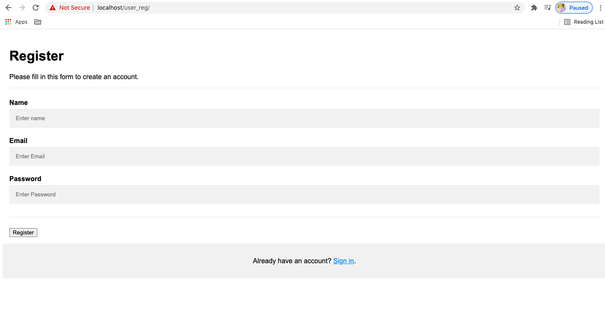

## Form validation System
This is a form validation system project. we will upload all resource here step by step.



### Our Project Feautures 
- Form fields value check
- Email value check
- Cell check
- Username check
- Special email check
- etc


## Reference Code
```php
<?php
  if(isset($_POST['submit'])){
     $name = $_POST['name'];
     $email = $_POST['email'];
     $password = $_POST['psw'];
     echo "Name: $name <hr>";
     echo "Email: $email <hr>";
     echo "Password: $password <hr>";

    if(empty($name) || empty($email) || empty($password)){
      $msg = "<h3 style='color:red'>All fields are required.</h3>";
    }
    else{
      $msg = "<h3 style='color:red'>Data Stable.</h3>";
    }
  }

 ?> 
 ```